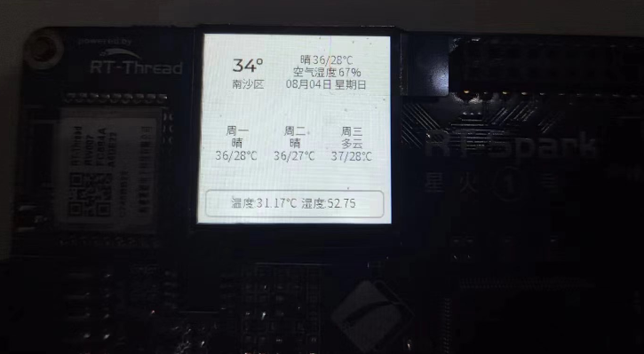
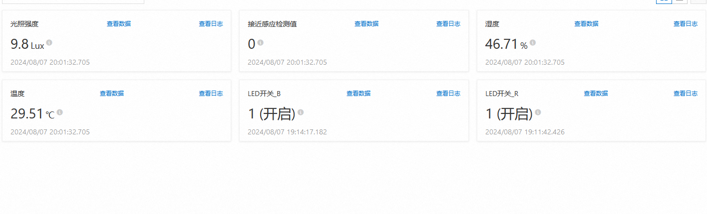
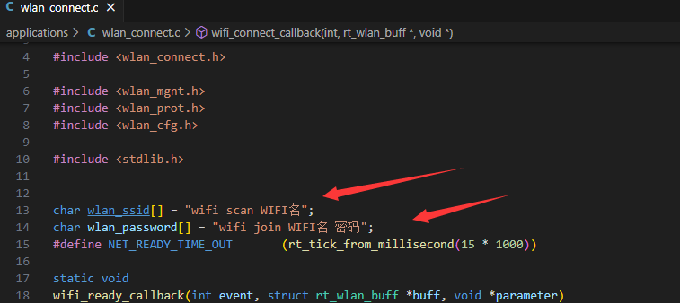
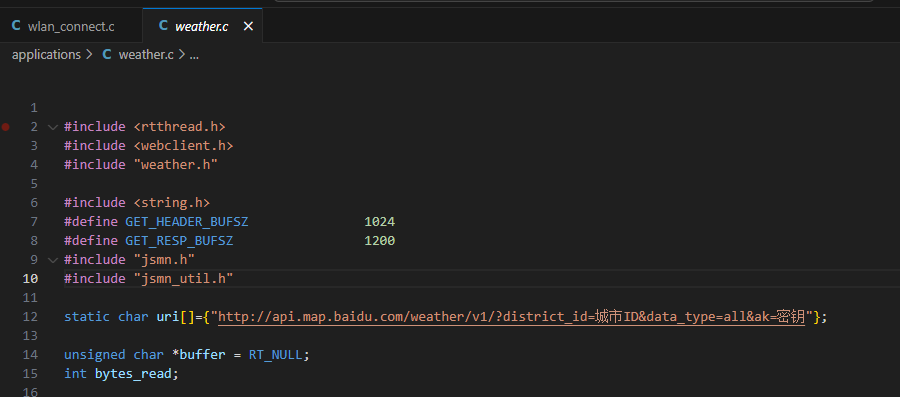
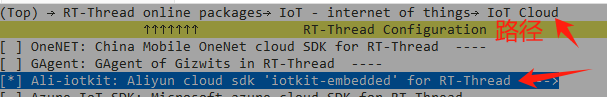
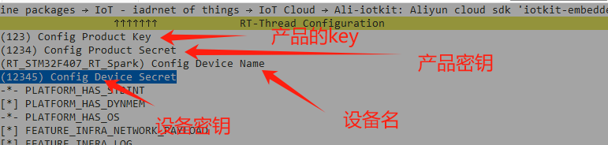
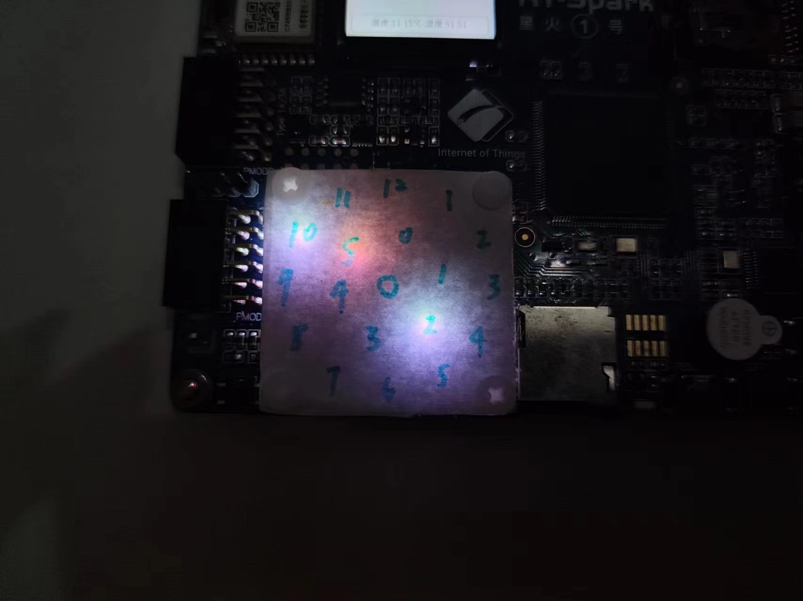

# RT_Thread-Spark_Muti_Weather_Desktop_Terminal

# 项目简介

本项目主要实现一个多功能天气桌面终端，支持连接WIFI，获取天气，实现了友好的显示数据界面，同时支持显示温湿度

另外温湿度,光照强度，接近传感器数据通过MQTT上传到阿里云平台,也可以通过阿里云平台控制板子上的led

最后使用了led matrix作为时钟显示时间

（有的地名有可能字库不支持，可以自己测试）

# 实现介绍

### LVGL

通过使用不同的控件来实现一个界面,创建定时器定时获取数据更新控件

### RW007

开机自动连接wifi，wifi断开自动尝试重连，同时获取RTC

### WebClient

向特定的天气api获取天气数据,并将获取的json数据解析成字符串，并传给lvgl

### LED MATRIX

实时获取RTC时间并通过特定规则显示时间

### AHT21

每秒测量一次温湿度并解析成LVGL控件的字符串

### ap3216c

 每5秒测量一次光照强度以及接近感应检测值

### MQTT

传感器数据每隔5秒上传至阿里云IOT平台，另外可以通过mqtt控制led灯的开启关闭

## 使用方法:

首先下载代码到本地

修改下wifi名和密码,以便能连上网络

设置API链接,这里用的是百度天气api，可以去官网申请

然后打开env输入menuconfig进入配置界面

通过下图的路径找到阿里云的软件包，回车进入

按照下图的格式回车修改对应的参数

然后烧写编译运行应该就可以正常使用了

### 关于时钟的阅读

单独看图片不太好看，实际运行起来还可以的

最外一圈是小时

内圈白色是分钟的百位数

红色是分钟的个位数

当中心亮起红色说明个位数从6开始

如图的时间是10：25

## 未来计划实现（挖坑）

添加语音识别

# 进度

已完成

# 最后结语

虽然项目比较简单，但是实际做起来容易踩坑，关于lvgl底层的一些代码还是不够理解,导致经常报错
